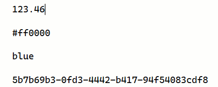

[marketplace]: https://marketplace.visualstudio.com/items?itemName=MadsKristensen.Shifter
[vsixgallery]: http://vsixgallery.com/extension/Shifter.2788249e-f649-4ef6-a0e4-e390ccdbe588/
[repo]:https://github.com/madskristensen/Shifter

# Shifter for Visual Studio

Download this extension from the [Visual Studio Marketplace][marketplace]
or get the [CI build][vsixgallery].

--------------------------------------

Shifter shifts the text under the caret depending on the text. For example, if the caret is on a number, Shifter will increase or decrease the number. This makes common tasks super quick and keyboard friendly.

The value being shifted is either the text where the caret is placed, or the selected text range.

## Keyboard shortcuts

* Shift up: **Ctrl+Alt+Up**
* Shift down: **Ctrl+Alt+Down**

## Supported shifts

**Numbers**, including decimals, will increase or decrease with a value that depends on the number of decimals.

**Hex colors** will either brighten or darken slightly when shifted.

**Named colors** will shift to the adjacent named color in the pallet. For instance, shifting up `blue` will make it `royalblue`.

**Guids** will be incremented or decremented when shifted. A quick way to change a guid slightly.

**Boolean** values such as `true/false`, `on/off`, `yes/no` will shift to the opposite regardless of shifting direction.

### How can I help?
If you enjoy using the extension, please give it a ★★★★★ rating on the [Visual Studio Marketplace][marketplace].

Should you encounter bugs or if you have feature requests, head on over to the [GitHub repo][repo] to open an issue if one doesn't already exist.

Pull requests are also very welcome, since I can't always get around to fixing all bugs myself. This is a personal passion project, so my time is limited.

Another way to help out is to [sponsor me on GitHub](https://github.com/sponsors/madskristensen).